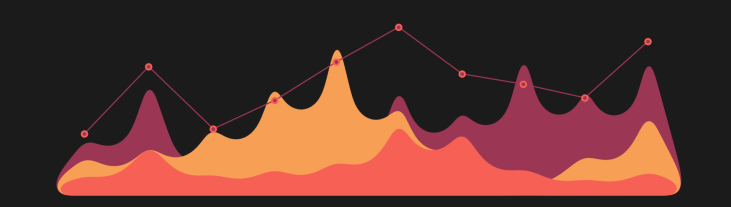

## Hi there 👋

- 🧑🏽‍🦱 I'm [Filippo Maria Bianchi](https://sites.google.com/view/filippombianchi/home)
- 🇮🇹 I'm Italian, but I live in Norway 🇳🇴
- 🎓 I'm an associate professor at UiT the Arctic University of Norway
- 🔬 I do research in ML for time series and graphs
- 🌍 I also work on remote sensing applications
- 🔓 I mostly work with Python, and I try to open-source all my work

---

## 📚 Libraries

## 👨‍🏫 Courses and tutorials

## 📊 Datasets

## 💻 Papers' code

### Graph Neural Networks

### Time series

### Other

